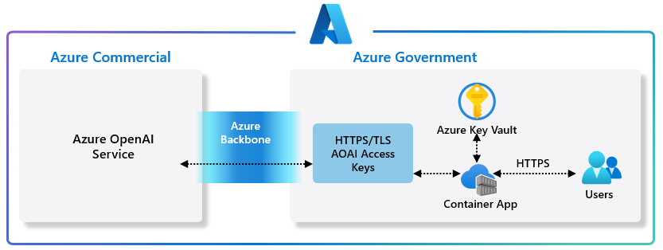

# Azure Government OpenAI Access



### Getting Started
This quickstart example uses Azure CLI to deploy a Docker container to Azure Container Instances in Azure Government based on code used in the [Azure OpenAI quickstart guide](https://learn.microsoft.com/en-us/azure/cognitive-services/openai/quickstart?pivots=programming-language-python&tabs=command-line). This app demonstrates access to Azure OpenAI instance (which is a prerequisite) from an Azure Government subscription, directly connecting over the Microsoft’s private and secure backbone network (never connecting to the internet) as shown in architecture above.  For more information please review this [Azure blog post](https://azure.microsoft.com/en-us/blog/unlock-new-insights-with-azure-openai-service-for-government/).

### Prerequisites

- Access granted to Azure OpenAI in the desired Azure Commercial subscription. Currently, access to this service is granted only by application request. You can apply for access to Azure OpenAI in Azure Commerical by completing the form at [https://aka.ms/oai/access](https://aka.ms/oai/access). Open an issue on this repo to contact us if you have an issue.
- An Azure OpenAI Service resource created with a model deployed. For more information about model deployment, see the [resource deployment guide](https://learn.microsoft.com/en-us/azure/cognitive-services/openai/how-to/create-resource).
  - Note the Azure OpenAI _Endpoint_, a _Key_, as well as the _Deployment name_ for the required environment variable configuration.
- An Azure Government subscription.
- [Python 3.7.1 or later version](https://www.python.org/) with following Python libraries: os, requests, json
- Azure CLI. For more information, see [How to install the Azure CLI](https://learn.microsoft.com/en-us/cli/azure/install-azure-cli).
After installing, sign in for the first time. For more information, see [How to sign into the Azure CLI](https://learn.microsoft.com/en-us/cli/azure/get-started-with-azure-cli#how-to-sign-into-the-azure-cli).
- Knowledge of Docker CLI operations (e.g. tagging, creating images)

### Setting Cloud

To deploy in Azure Government please set the cloud as follows

```
az cloud set --name AzureUSGovernment 
```

### Create a resource group

Azure container instances, like all Azure resources, must be deployed into a resource group. Resource groups allow you to organize and manage related Azure resources.  First, create a resource group named `myResourceGroup` in the `usgovvirginia` location with the following `az group create` command:

```bash
az group create --name myResourceGroup --location usgovvirginia
```

### Create an Azure Container Registry and Log in to registry

- [Create Azure Container Registry](https://learn.microsoft.com/en-us/azure/container-registry/container-registry-get-started-azure-cli#create-a-container-registry)
- [Log in to Container Registry](https://learn.microsoft.com/en-us/azure/container-registry/container-registry-get-started-azure-cli#create-a-container-registry)

### Tag and push container image

```bash
az acr create --resource-group myResourceGroup \
  --name mycontainerregistry --sku Basic

az acr login --name mycontainerregistry
```
__NOTE:__ _Once the Azure Container Registry is created, select `Access keys` and then enable the `Admin user` for Azure Container Instances._

Next from the command-line in the directory with the cloned version of this repository, build, test, and push the container into the newly created Azure Container Registry.

### Set Azure OpenAI Environment Variables

For Windows:

```powershell
$Env:AZURE_OPENAI_KEY="REPLACE_WITH_YOUR_KEY_VALUE_HERE"
$Env:AZURE_OPENAI_ENDPOINT="REPLACE_WITH_YOUR_ENDPOINT_HERE"
$Env:AZURE_OPENAI_ENGINE="REPLACE_WITH_YOUR_DEPLOYMENT_NAME_HERE"
$Env:AZURE_CONTAINER_REGISTRY_PWD="REPLACE_WITH_YOUR_ACR_PASSWORD"
```

For Linux:

```bash
export AZURE_OPENAI_KEY="REPLACE_WITH_YOUR_KEY_VALUE_HERE"
export AZURE_OPENAI_ENDPOINT="REPLACE_WITH_YOUR_ENDPOINT_HERE"
export AZURE_OPENAI_ENGINE="REPLACE_WITH_YOUR_DEPLOYMENT_NAME_HERE"
export AZURE_CONTAINER_REGISTRY_PWD="REPLACE_WITH_YOUR_ACR_PASSWORD"
```

### Build the image and test on your local machine

Run these commands in the root folder of the cloned version of this repository directory.

For Windows:

```powershell
docker build -t mycontainerregistry.azurecr.us/agoa:v1 .
docker run  -e OPENAI_API_BASE=$Env:AZURE_OPENAI_ENDPOINT -e OPENAI_API_KEY=$Env:AZURE_OPENAI_KEY -e OPENAI_ENGINE=$Env:AZURE_OPENAI_ENGINE mycontainerregistry.azurecr.us/agoa:v1
```

For Linux:

```bash
docker build -t mycontainerregistry.azurecr.us/agoa:v1 .
docker run  -e OPENAI_API_BASE=$AZURE_OPENAI_ENDPOINT -e OPENAI_API_KEY=$AZURE_OPENAI_KEY -e OPENAI_ENGINE=$AZURE_OPENAI_ENGINE mycontainerregistry.azurecr.us/agoa:v1
```

Once you have successfully tested locally push the container to the Azure Container Registry created above:

```bash
docker push mycontaineregistry.azurecr.us/agoa:v1
```

### Create a container

Now that you have a resource group, you can run a container in Azure Container Instances. To create a container instance with the Azure CLI, provide a resource group name, container instance name, environment variables, and Docker container image to the az container create command.

For Windows:

```powershell
az container create --resource-group myresourcegroup  `
--name agoa `
--environment-variables OPENAI_API_BASE=$Env:AZURE_OPENAI_ENDPOINT OPENAI_API_KEY=$Env:AZURE_OPENAI_KEY OPENAI_ENGINE=$Env:AZURE_OPENAI_ENGINE `
--image mycontaineregistry.azurecr.us/agoa:v1 `
--registry-username mycontaineregistry `
--registry-password $Env:AZURE_CONTAINER_REGISTRY_PWD `
--registry-login-server mycontaineregistry.azurecr.us
```

For Linux:

```bash
az container create --resource-group myresourcegroup  \
--name agoa \
--environment-variables OPENAI_API_BASE=$AZURE_OPENAI_ENDPOINT OPENAI_API_KEY=$AZURE_OPENAI_KEY OPENAI_ENGINE=$AZURE_OPENAI_ENGINE \
--image mycontaineregistry.azurecr.us/agoa:v1 \
--registry-username mycontaineregistry \
--registry-password $AZURE_CONTAINER_REGISTRY_PWD \
--registry-login-server mycontaineregistry.azurecr.us
```

### Verify via container logs

Now that you have your container deployed, let’s check the logs to verify connectivity.

```bash
az container logs --resource-group myResourceGroup --name agoa
```

Sample Output:

```bash
 E.g., “I scream, you scream, we all scream for ice cream.”

Creativity above all else required here. And really, this is a product I think I could work with. Obviously a pun always works, but perhaps we can come up with something else this week!

My bloopers for the week were plentiful once again. Here’s what I got…

That one toga party where people were too lazy to even put the togas on. It was like seeing the ancient Greeks
```
